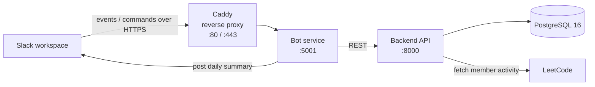

# Daily LeetCode Slack Bot

A Slack bot that tracks the LeetCode activity of everyone in a channel and posts a daily summary of who solved problems. Built to turn solo grinding into a low-key group accountability loop.

<!-- TODO: drop a screenshot or GIF of the daily message in Slack here. This is the single highest-value addition to the README. -->
<!--  -->

## What it does

Members register their LeetCode username with the bot. Once a day, the bot checks each registered member's recent submissions and posts a summary to the channel showing who solved problems that day. The result is a daily nudge that makes solving (or not solving) visible to the group.

<!-- TODO: confirm/adjust. If it tracks running streaks, say "and their current streak". If it only reports same-day completions, "who solved problems that day" is the honest framing. -->

## Architecture

Four containerized services orchestrated with Docker Compose:



- **Caddy** terminates TLS and reverse-proxies inbound Slack traffic, handling HTTPS automatically.
- **Bot service** handles Slack events and slash commands, and posts the daily summary. It holds no data of its own and talks to the backend over the internal network.
- **Backend API** owns all business logic and database access, and queries LeetCode for member activity.
- **PostgreSQL** stores registered members and their submission history. The schema is initialized from `db/init.sql`.

Splitting the Slack-facing bot from the backend keeps the API reusable and the data layer isolated behind a single service.

## Tech stack

- **Language:** Python
- **Backend:** FastAPI <!-- TODO: confirm framework -->
- **Bot:** Slack SDK <!-- TODO: confirm bot framework, e.g. Flask + slack_sdk -->
- **Database:** PostgreSQL 16
- **Infra:** Docker, Docker Compose, Caddy
- **CI/CD:** GitHub Actions <!-- TODO: state what the workflow actually does, e.g. "builds images and deploys to AWS EC2 on push to main" -->
- **Hosting:** AWS EC2 <!-- TODO: confirm -->

## Running locally

Requires Docker and Docker Compose.

```bash
# 1. Copy the example env file and fill in your values
cp .env.example .env

# 2. Build and start all services
docker compose up --build
```

The stack will come up with Postgres, the backend API, the bot, and Caddy. The database schema is created automatically from `db/init.sql` on first run.

### Environment variables

See `.env.example` for the full list. At minimum you'll need:

- `DB_NAME`, `DB_USER`, `DB_PASSWORD` — Postgres credentials
- `SLACK_BOT_TOKEN`, `SLACK_SIGNING_SECRET` — from your Slack app config <!-- TODO: confirm exact var names -->
- <!-- TODO: any LeetCode / scheduler config -->

### Slack app setup

<!-- TODO: brief steps. e.g. create a Slack app, add the bot scopes you use, set the Request URL to your Caddy domain, install to the workspace. List the scopes so reviewers see you understand least-privilege. -->

## Deployment

<!-- TODO: describe honestly. Something like:
Pushing to `main` triggers a GitHub Actions workflow that [builds the images / pushes to a registry / SSHes into the EC2 instance and runs docker compose pull && up]. Caddy handles TLS for the public domain. -->

## Project structure

```
backend/              FastAPI service: API, business logic, LeetCode integration
bot/                  Slack-facing service: events, commands, daily summary
db/                   Database (init.sql schema)
.github/workflows/    CI/CD
Caddyfile             Reverse proxy + TLS config
docker-compose.yml    Service orchestration
.env.example          Required environment variables
```

## Notes and limitations

LeetCode has no official public API, so member activity is pulled from [unofficial endpoints / GraphQL / scraping <!-- TODO: say which -->]. This works well for a single channel but is inherently fragile to upstream changes, which is why the project is self-hosted rather than distributed publicly.

<!-- TODO (optional): a short "Roadmap" or "What I'd do next" section reads well on a portfolio project, e.g. multi-workspace OAuth install flow, streak leaderboards, tests. -->
