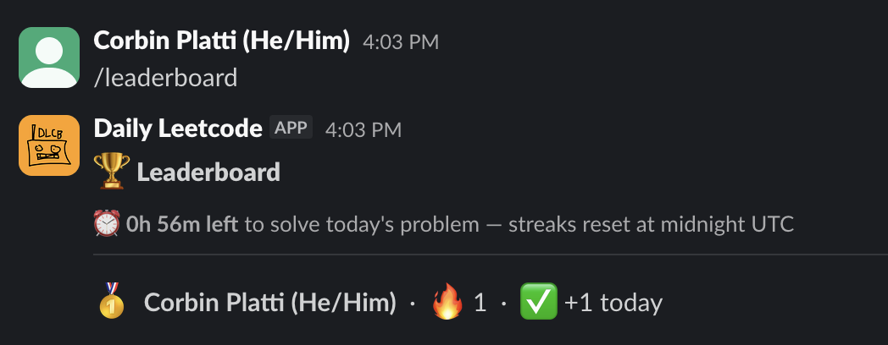
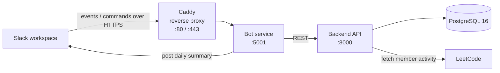
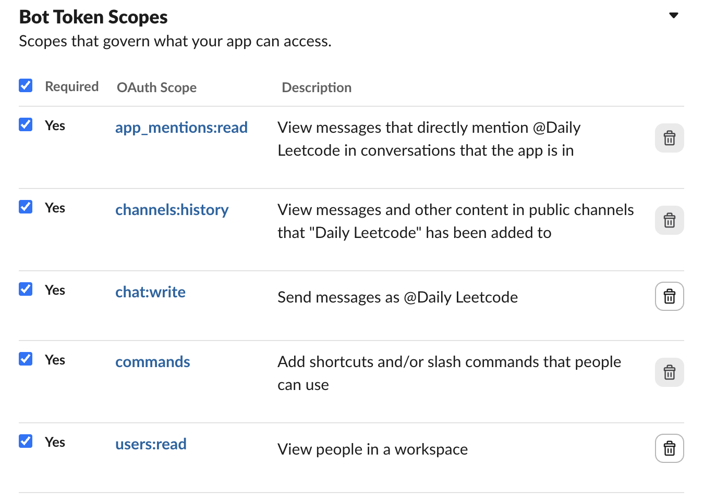
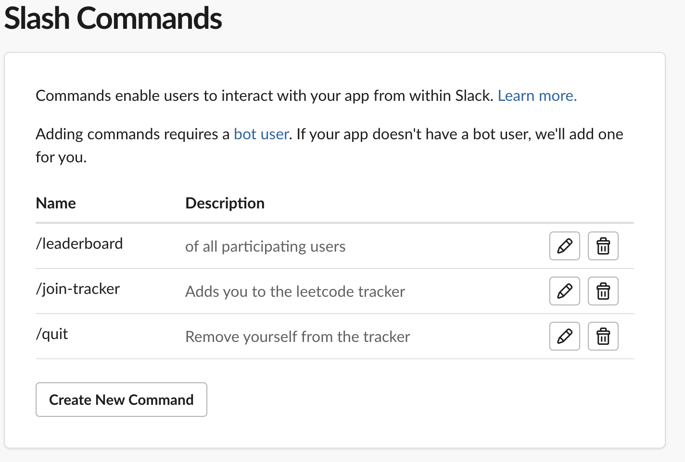

# Daily LeetCode Slack Bot

A Slack bot that tracks the LeetCode activity of everyone in a channel and posts a daily summary of who solved problems.



## What it Does

Members register their LeetCode username with the bot to initialize a streak. Every day at UTC midnight, the bot checks each registered member's recent submissions and updates an internal streak tracker to reflect each user's new streak. Using the `/leaderboard` command, users can check their streaks and rankings relative to other participants.

## Architecture

Four containerized services orchestrated with Docker Compose:


- **Bot service** handles Slack events and slash commands, and posts the daily summary. It holds no data of its own and talks to the backend over the internal network.
- **Backend API** owns all business logic and database access, and queries LeetCode for member activity.
- **PostgreSQL** stores registered members, their current streak lengths, and their streak records. The schema is initialized from `db/init.sql`.

Splitting the Slack-facing bot from the backend keeps the API reusable and the data layer isolated behind a single service.

## Tech Stack

- **Language:** Python
- **Backend:** FastAPI
- **Bot:** Flask + Slack SDK
- **Database:** PostgreSQL 16
- **Infra:** Docker, Docker Compose, Caddy
- **CI/CD:** GitHub Actions (deploy on push)
- **Hosting:** AWS EC2

## Running Locally

Requires Docker and Docker Compose.

```bash
# 1. Copy the example env file and fill in your values
cp .env.example .env

# 2. Build and start all services
docker compose up --build
```

The stack will come up with Postgres, the backend API, the bot, and Caddy. The database schema is created automatically from `db/init.sql` on first run.

### Environment Variables

See `.env.example` for the full list. At minimum you'll need:

- `DB_NAME`, `DB_USER`, `DB_PASSWORD` — Postgres credentials
- `SLACK_TOKEN`, `SLACK_SIGNING_SECRET` — from your Slack app config

### Slack App Setup
Create a slack bot in your Slack Developer Account and add the following scopes:

Add the following slash commands:

Set the request URL to port 5001 on your *public* server (or whatever port you may have listed in the Caddyfile) and install the app to your workspace.

## Deployment

Pushing to the main branch triggers a GitHub Actions workflow that SSHes into an EC2 instance, pulls the repository changes, and runs docker compose.

## Project Structure

```
backend/              FastAPI service: API, business logic, LeetCode integration
bot/                  Slack-facing service: events, commands, daily summary
db/                   Database (init.sql schema)
.github/workflows/    CI/CD
Caddyfile             Reverse proxy + TLS config
docker-compose.yml    Service orchestration
.env.example          Required environment variables
```

## Notes and Limitations

LeetCode has no official public API, so member activity is pulled from an unofficial GraphQL endpoint. This works well for a single project but is inherently fragile to upstream changes.

## Next Steps
A feature that I would like to add is a command which toggles an option for the bot to send a daily leaderboard update to a specified channel. This way, participants can have more accountability via a daily message which will "expose their lost streak", without forcing users to have a daily message which could annoy them. Implementing this would involve adding a new command, and modifying the database to store information about workspaces in addition to individual users.
<!-- TODO (optional): a short "Roadmap" or "What I'd do next" section reads well on a portfolio project, e.g. multi-workspace OAuth install flow, streak leaderboards, tests. -->
